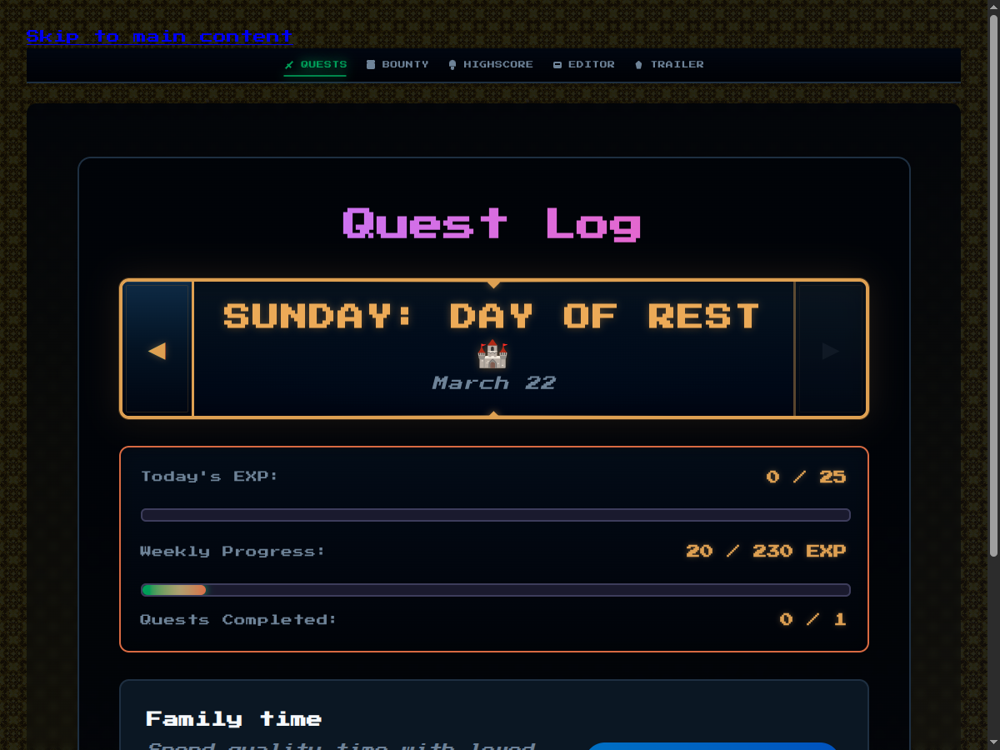
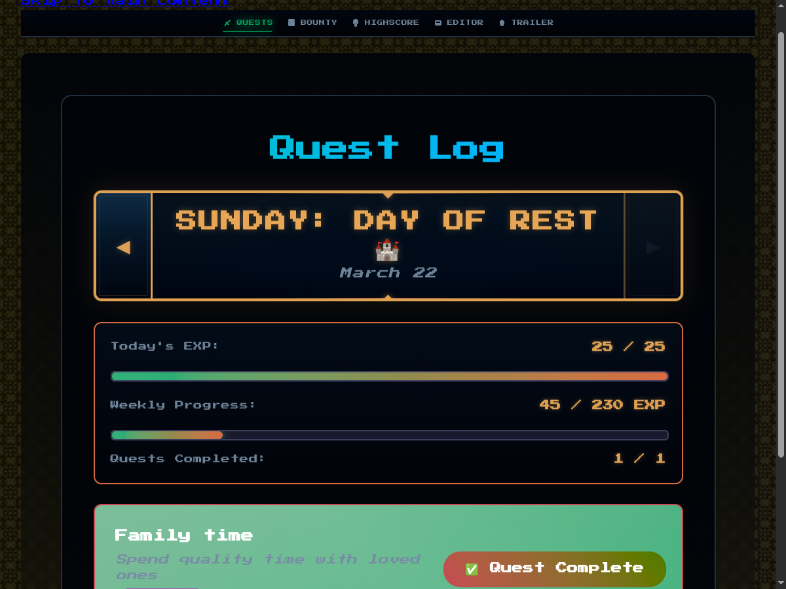
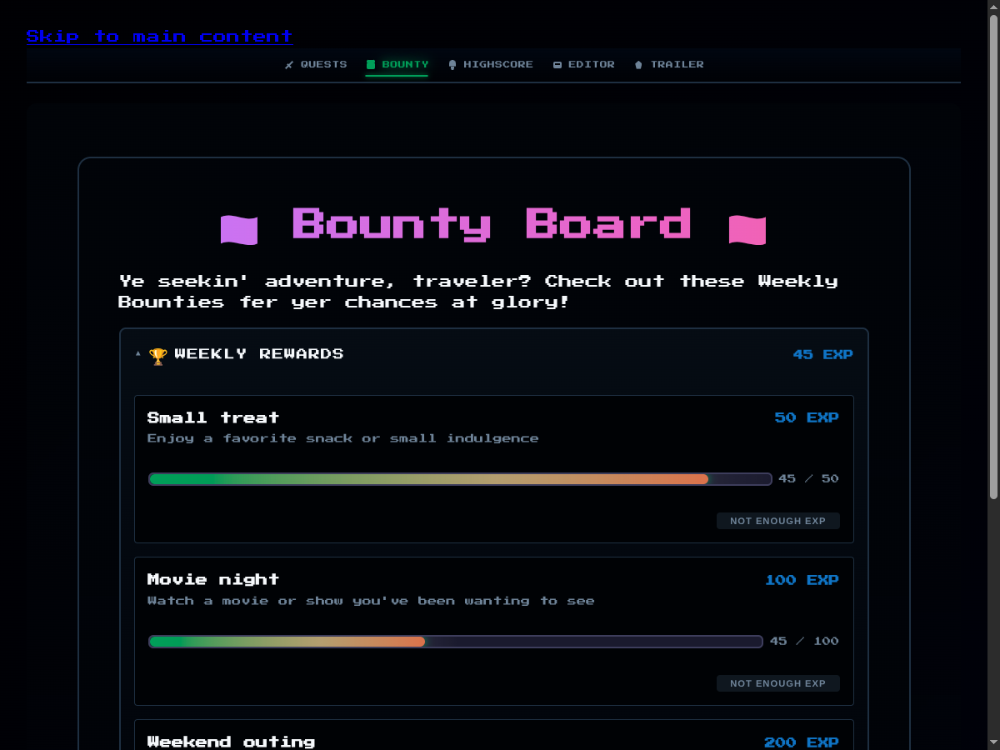

# Quest Log


Turn chores into adventures

<!-- end_slide -->

# The Problem

Getting kids to do chores is...

**Hard**

Nagging → Resistance → Frustration

<!-- end_slide -->

# The Idea

What if chores were quests?

<!-- pause -->

Your child is the hero. Their tasks are adventures. Completing them earns XP.

<!-- end_slide -->

# The Quest Log

Daily quests. Track progress. Earn XP.



<!-- end_slide -->

# Instant Gratification

Check a quest → XP goes up → Dopamine hit



<!-- end_slide -->

# The Bounty Board

Weekly rewards. Real stakes.



<!-- end_slide -->

# Built for Simplicity

- **No logins** — single household, zero friction
- **Real-time** — SSE updates across devices
- **Offline-first** — PWA that works anywhere
- **Self-hosted** — your data, your server

<!-- end_slide -->

# Under the Hood

Rust · Axum · SQLite · Datastar

Fast. Reliable. 21.6MB binary.

<!-- end_slide -->

# Deploy in Seconds

```bash
podman run -p 3000:3000 ghcr.io/bugabinga/quest-log
```

One container. Done.

<!-- end_slide -->

# Level Up Your Household

Quest Log

Because "please clean your room" wasn't a compelling quest objective.

<!-- speaker_note: Quest Log — because sometimes you need to gameify everything just to get basic cooperation. Built with Rust, deployed with one command, and designed to make chores feel like adventures. Your results may vary. Side effects include occasional enthusiasm and negotiations over XP values. -->
